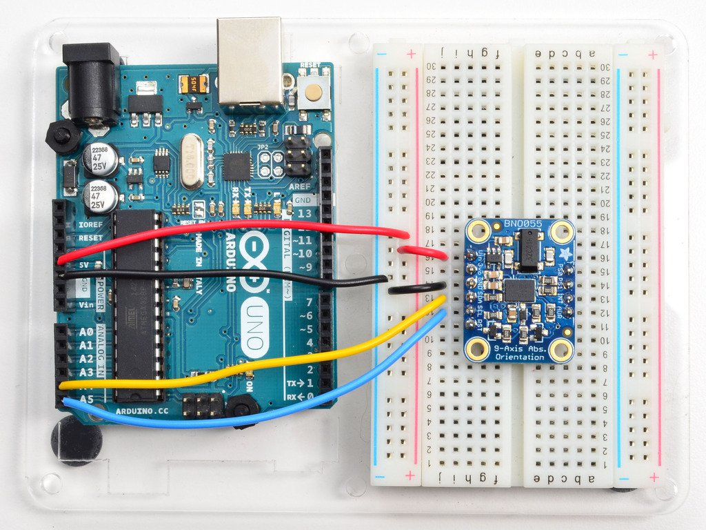

# Gesture-Generative-Sound

HI!

- Connect Vin to the power supply, 3-5V is fine. Use the same voltage that the microcontroller logic is based off of. For most Arduinos, that is 5V
- Connect GND to common power/data ground
- Connect the SCL pin to the A5
- Connect the SDA pin to the A4

Try to use OSC on phone. Download app TouchOSC.
Open TouchOSC, connect to the computer and set up the accelerometer in "options".
In computer, open OSCulator and settings are as follows:

# References

https://learn.adafruit.com/adafruit-bno055-absolute-orientation-sensor/arduino-code
Library: https://github.com/adafruit/Adafruit_Sensor
MAX OSC ACCELEROMETER: https://www.youtube.com/watch?v=FxkfbvP9cm0
